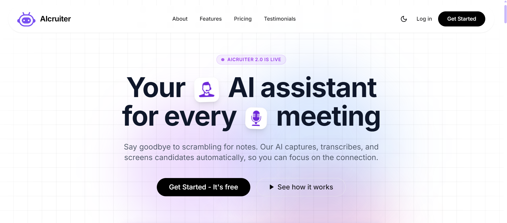
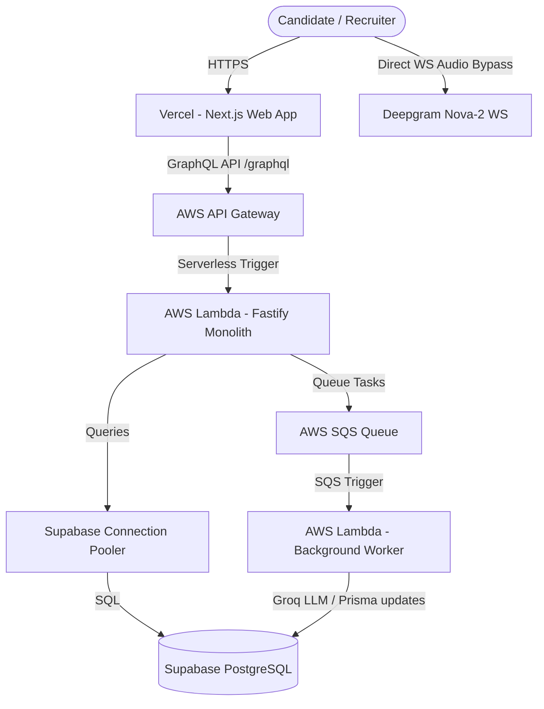

# 🤖 AIcruiter — Intelligent Candidate Screening & Voice Interviewing Platform

AIcruiter is a state-of-the-art **AI Voice Agent & Applicant Screening Platform** designed for recruiters to automate initial-stage interviews. It conducts real-time natural language voice conversations with candidates, evaluates job requirements, and delivers detailed evaluation reports directly to a recruiter dashboard.

This project was built to showcase **full-stack engineering excellence, system architecture design, and performance optimizations** in high-throughput AI screening environments.

---

## 🌟 Key Engineering Accomplishments (The "Why & How")

When presenting this project to technical interviewers and hiring managers, here are the core engineering challenges solved:

### 1. Cost & Latency Optimization via Browser-Direct WebSocket Audio Bypass 🎙️
*   **The Challenge:** Streaming real-time audio through a backend server proxy introduces high latency, demands heavy CPU/network resources, and compromises scalability.
*   **The Solution:** Implemented a browser-direct bypass pipeline. The client requests a short-lived (60s TTL), restricted Deepgram API credentials token via a GraphQL mutation. The client browser then establishes a direct WebSocket connection to Deepgram's streaming API, reducing latency to near-zero and eliminating server bandwidth bottlenecks.

### 2. Dialogue Compression & LLM Token Efficiency 📋
*   **The Challenge:** Processing full audio transcripts with an LLM for evaluations results in high API token costs and slower report generation.
*   **The Solution:** Developed a text pre-processing compression engine (`compressDialogue`) that strips conversational fillers (*um, uh, like, you know*) and discards redundant greeting/closing turns. It filters out empty turns before querying Groq's Llama-3 model, resulting in **30%+ token usage savings** and faster evaluation generation.

### 3. High-Performance Connection Pooling with Supavisor & Prisma 🗄️
*   **The Challenge:** Serverless environments (like AWS Lambda) spin up and tear down containers rapidly, causing database connection exhaustion on standard PostgreSQL databases.
*   **The Solution:** Integrated Prisma client connectors with **Supavisor** (Supabase's high-performance connection pooler) using transaction mode (`port 6543`, `pgbouncer=true`). Direct connections are reserved strictly for schema migrations, keeping connection counts low and query throughput high.

### 4. Custom Theme-Native Select Dropdowns (UX Polish) 🎨
*   **The Challenge:** Browser-native HTML select elements are notoriously difficult to style consistently, leading to broken dark/light theme aesthetics in candidate-facing portals.
*   **The Solution:** Developed custom React `CustomSelect` dropdown elements featuring Framer Motion micro-animations, click-outside hooks, search filters, and checkmark state indicators that match the platform's glassmorphic styling system.

### 5. LinkedIn-Style Focus Skills Autocomplete Tagging 🧩
*   **The Challenge:** Recruiter portals require a smooth way to capture focus skill sets without database lock-ups or rigid inputs.
*   **The Solution:** Designed an autocomplete skill suggestion input that allows recruiters to search, select standard tech/product skill badges, clear tag lists, and input custom tags dynamically.

---

## 🗺️ System Architecture & Topology

AIcruiter is structured as a **Serverless Modular Monolith (Lambdalith)** managed via **Turborepo** and **pnpm workspaces** for rapid CI/CD, modular scaling, and code-sharing:

### Repository Workspaces
-   `apps/web/`: A responsive Next.js 16 client application leveraging React Server Components, custom routing adapters, and Tailwind CSS.
-   `apps/api/`: Fastify Node.js GraphQL gateway server packaged with the **AWS Lambda Web Adapter** binary inside Docker to run seamlessly on serverless runtimes.
-   `packages/db/`: Prisma Client wrapper and schema definitions.
-   `packages/types/`: Shared validation schemas and typings utilizing Zod.

---

## 🛠️ Technology Stack

-   **Frontend**: React, Next.js 16 (App Router), TypeScript, Tailwind CSS, Framer Motion, Apollo Client
-   **Backend**: Node.js, Fastify, Apollo Server GraphQL, AWS Lambda Web Adapter, Docker
-   **Database**: Supabase PostgreSQL, Prisma Client, Supavisor Connection Pooler
-   **AI Services**: Deepgram Nova-2 (STT), Deepgram Aura (TTS), Groq Llama-3 (LLM)
-   **Tooling**: Turborepo, pnpm Workspaces, Zod, Sonner, Lucide React

---

## 📖 Deep-Dive References

For a comprehensive technical analysis of this platform, check out:
*   [CODEBASE_GUIDE.md](CODEBASE_GUIDE.md): Explains PostgreSQL entity relationships, database schemas, Next.js dynamic routing adaptors, and Docker multi-stage build scripts.
*   [CandidatesPage.tsx](apps/web/components/pages/CandidatesPage.tsx): Custom filtering dropdowns and candidate evaluation components.
*   [report-worker.ts](apps/api/src/services/report-worker.ts): Dialogue pre-processing compression algorithm and AI evaluation logic.
